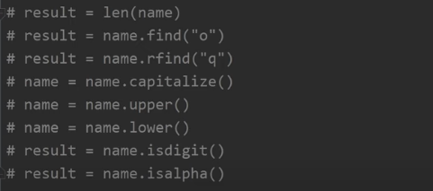
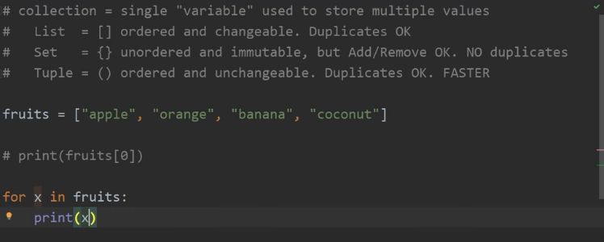
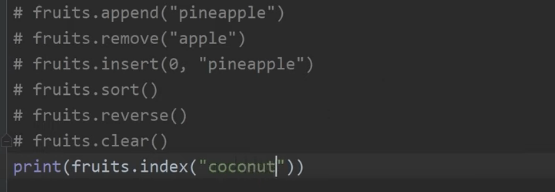

## Python Interview Questions

### 1. What is Python?
Python is object-oriented, open source, dynamically typed language. It's an interpreted language.

### 2. Why interpreted Language?
Because every time you run the code, its compiled into machine code and executed line by line by the interpreter. 
Whereas in case of Java, entire file is converted to byte code and the byte code is executed by JVM.

Compilers take source code, such as C or Basic, and compile it into machine code, typically saved in executable form. Interpreted languages differ from compiled languages: Interpreted code (e.g., shell code) is compiled on the fly each time the program is run. 
If an interpreted program is run 100 times, it will be compiled 100 times (whereas a compiled program is compiled only once).

### 3. Data Types in Python?
1. String
2. Integer
3. Float
4. Boolean

A variable is a container for storing values(string, integer, float , boolean)

#### Strings
name = "aditya"

#### Integer
age = 25

#### Float
price = 10.99

#### Boolean
is_student = False

### 4. What is TypeCasting in Python?
The process of converting a variable from one data type to another using str(), int(), float(), boolean()

name = "aditya"
age = 25
is_student = False
gpa = 10.2

age = str(age)
print(age)

### 5. Input?
input() => A function that prompts the user to enter the data and return the entered data as string

name = input("what's your name")
age = int(input("How old are you")) //type cast another way

age = int(age) // type cast to store int values
age = age +1

print(f"{name}")
print(f"{age}")

### 6. Calculate ?

```java
import math
radius = float(input('Enter the radius'))
circumference = 2 * math.pi * radius
print(f"The circumference is {circumference}")
```

### 7. if else conditions

```java
age = int(input("Enter the age:"))
if age >= 18:
   print("You are eligible")
elif age < 18:
   print("You are in eligible")
else:
   print("invalid age")
```

### 8. Python String methods?

Some common string methods-


### 9. Collections in Phython?


List methods-




